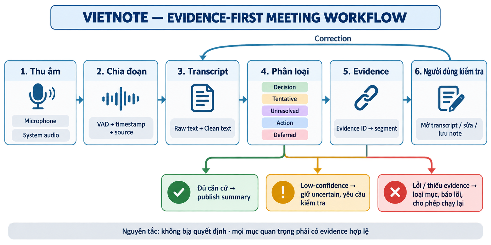

# AI SPEC — Ghi chú cuộc họp có bằng chứng · Nhóm Unicorn · Zone C4

Hạn chốt spec: 21:00, 17/09/2026 · CP4
Hướng: [ ] A — VLearn  [ ] B — Trợ lý Học viên  [x] C — Làn mở
Loại: [x] Tối ưu tính năng có sẵn  [ ] Tính năng mới

## §1. User & Job

- Job executor + workflow (worksheet JTBD/sơ đồ): người tham gia hoặc người chủ trì cuộc họp nói vào microphone hoặc phát âm thanh hệ thống → chọn ngôn ngữ và nguồn âm thanh → VietNote nhận diện theo đoạn → người dùng xem transcript/tóm tắt cập nhật → kết thúc cuộc họp để tạo note đầy đủ → mở evidence từ summary về segment transcript tương ứng.

_Hình 1. Workflow từ thu âm, tạo transcript, phân loại nội dung, kiểm tra evidence đến lưu note; gồm cả nhánh low-confidence, lỗi và correction._

- Core JTBD: Khi đang tham gia một cuộc họp có nhiều thông tin cần nhớ, tôi muốn ghi lại và sắp xếp các ý quan trọng theo bằng chứng, để sau cuộc họp biết điều gì đã chốt, ai làm gì, điều gì còn bỏ ngỏ và không phải ghi chép thủ công.
- Problem statement: Transcript có thể bị nhiễu, mất câu ngắn, sai số liệu/tên riêng hoặc trộn nguồn âm thanh; một bản tóm tắt không có căn cứ có thể biến đề xuất thành quyết định hoặc gán sai người phụ trách.
- Evidence (nguồn trong repo):
  - Báo cáo baseline ghi nhận Whisper Turbo sinh hallucination từ tiếng ồn như câu quảng bá, có thể bỏ câu ngắn “Khảo sát chưa…”, và làm sai tên “chị Mai” thành “chị May” (`ASR_QUALITY_REPORT.md`, §1 và §7.2).
  - Pipeline hiện có 21 test tự động bao phủ VAD, lọc hallucination, deduplication, chọn model/ngôn ngữ, protocol socket, Groq adapter và tách context hai nguồn (`ASR_QUALITY_REPORT.md`, §8; `eval/test_pipeline.py`).
  - Mẫu meeting tổng hợp cho thấy PhoWhisper giữ được trạng thái khảo sát, số liệu và action item; latency ASR trung bình khoảng 2,23 giây/segment và end-to-end khoảng 5,3–5,6 giây (`ASR_QUALITY_REPORT.md`, §7.2).
  - Golden set 20 câu đã có sẵn tại `eval/vietnote_acceptance_cases.json`; tiêu chí trượt ngay gồm bịa quyết định, đảo phủ định, đổi số liệu/ngày, gán sai người hoặc trỏ sai evidence (`eval/VietNote_ACCEPTANCE_TESTS.md`).
  - Acceptance run v1.1: đã thử 20 câu, đạt 15 câu, chưa đạt 5 câu, tỷ lệ 75%; chưa đạt ngưỡng số lượng MVP và còn 2 lỗi nghiêm trọng (`VietNote Acceptance Report — v1.1 câu đơn giản`, do nhóm cung cấp ngày 17/09/2026).
- Ví dụ nguyên văn từ golden test, không phải quote người dùng:
  1. “Khảo sát chưa hoàn tất.” — `eval/vietnote_acceptance_cases.json`, VN16; kiểm tra câu ngắn.
  2. “Hiện có 86 trên 120 phản hồi, còn thiếu 34 phản hồi.” — file trên, VN02; kiểm tra số liệu.
  3. “Lan gửi báo cáo tổng hợp trước 10 giờ sáng thứ Sáu.” — file trên, VN03; kiểm tra owner/deadline.
  4. “Chưa quyết định chọn cách lưu dữ liệu A hay cách lưu dữ liệu B.” — file trên, VN04; kiểm tra phủ định và unresolved.
  5. “Tôi đề xuất dùng microphone trước, nhưng nhóm chưa chốt.” — file trên, VN08; kiểm tra proposal không bị biến thành decision.
  6. “Không bật TTS trong cuộc họp này và không gửi audio lên server local.” — file trên, VN12; kiểm tra phủ định kép.
  7. “Microphone nói dùng tiếng Việt; system audio nói giữ nguyên tên sản phẩm VietNote.” — file trên, VN17; kiểm tra tách nguồn.
- Quote nguyên văn từ validation người dùng:
  1. “App có UI khá đẹp, màu sắc và animation rất tốt, app dễ dùng.”
  2. “Tính năng khá hay và thật sự có nhu cầu.”
  3. “Liệu có thể tạo thành chatbot cho discord không”
  4. “Hiện tại Notion cũng có chức năng tương tự thì sao”
  5. “Có đảm bảo tính bảo mật dữ liệu không”
  6. “Người dùng hỏi bạn dùng gì để xử lý audio tiếng việt đầu vào”
  7. “Nhưng người dùng đặc câu hỏi là trên thị trường đã có app tương tự chưa, điểm khác biệt là gì. Liệu nhu cầu này có thực sự cao, có phải nỗi đau thực sự không. Chức năng dịch chất lượng như thế nào, làm sao để đánh giá là tốt.”

## §2. Impact & quyết định chọn

| Ứng viên | Bao nhiêu người | Tần suất | Tốn gì mỗi lần | Khả thi với repo hiện tại |
|---|---:|---|---|---|
| Transcript realtime chống nhiễu và giữ câu ngắn | 4 | Mỗi segment 3,2 giây local hoặc tối đa 10 giây Groq | Mất thông tin, phải nghe/ghi lại | Cao: đã có VAD thích nghi, filter, glossary và 21 test |
| Structured meeting summary: decision/action/unresolved/evidence | 4 | Mỗi đoạn cập nhật và một lần khi kết thúc meeting | Tốn thời gian tổng hợp; rủi ro quyết định sai | Cao: đã có schema, prompt, validation evidence và UI |
| Dịch Anh/Trung → Việt theo đoạn + TTS | 4 | Mỗi paragraph khi họp đa ngôn ngữ | Chậm theo dõi hoặc phải dịch thủ công | Trung bình: đã có API local, ZeroTTS và UI; chưa có corpus đa ngôn ngữ thật |

- Ứng viên đã loại khỏi lát cắt này: tự động gán speaker/owner khi tên không được nói rõ — vì chi phí lỗi cao, repo cũng nêu rõ chưa có speaker diarization; chỉ ghi owner khi tên xuất hiện trong transcript.
- Ứng viên chọn: structured meeting summary có transcript evidence, được hỗ trợ bởi transcript realtime chống nhiễu.
- Vì sao (bằng số): bộ kiểm thử chấp nhận có 20 case và quy định PASS MVP là ≥16/20 (≥80%) với 0 lỗi nghiêm trọng; 21/21 regression test pipeline hiện đã pass theo báo cáo. Đây là lát cắt duy nhất đồng thời đo được phân loại nội dung và khả năng kiểm chứng, không chỉ đo text output.
- Gaps tác động cần đo trước validation thật: số người dùng, số cuộc họp/tuần, thời gian ghi chép tiết kiệm, tỷ lệ click evidence, p50/p95 latency và WER/CER trên giọng thật.

## §3. Giải pháp tương tự đã nghiên cứu

### Otter.ai — AI meeting notetaker

- **Flow:** Người dùng ghi âm trực tiếp, tải audio/video lên hoặc cho Otter tham gia cuộc họp Zoom/Teams/Meet → hệ thống tạo transcript → sinh các phần `Summary`, `Action Items` và `Outline` → người dùng xem lại, sửa/gán lại action item → mở `View in transcript` để quay về đoạn transcript làm căn cứ → export/chia sẻ kết quả.
- **Đáng học:** Gom transcript và summary trong cùng một conversation; chia output thành các phần dễ quét; action item có liên kết quay về vị trí trong transcript; cho phép chỉnh sửa, gán lại và export thay vì coi output AI là bất biến.
- **Đáng né:** Không được mặc định tin summary hoặc owner do AI tự gán. Chính tài liệu Otter cảnh báo summary có thể hallucinate, bỏ sót điều kiện, nhầm owner/ngày hạn; các lỗi này có thể làm sai quyết định hoặc giao việc. Với VietNote, mọi mục quan trọng phải qua kiểm tra evidence ID và giữ trạng thái chưa chắc chắn khi không đủ căn cứ.
- **VietNote khác gì:** Otter tối ưu cho notetaking cộng tác, tích hợp nhiều nền tảng họp và chia sẻ note. VietNote chọn lát cắt hẹp hơn: phân biệt `decision` / `tentative decision` / `unresolved` / `action` / `deferred`, giữ raw text cạnh clean text, buộc mục quan trọng trỏ tới evidence ID hợp lệ, tách ngữ cảnh `microphone`/`system`, không lưu audio và ưu tiên xử lý local hoặc endpoint người dùng cấu hình.
- **Nguồn nghiên cứu chính thức:** [Conversation Page Overview](https://help.otter.ai/hc/en-us/articles/5093228433687-Conversation-Page-Overview), [Action Items Overview](https://help.otter.ai/hc/en-us/articles/25983095114519-Action-Items-Overview), [AI to summarize transcripts](https://otter.ai/blog/ai-to-summarize-transcripts), truy cập ngày 17/09/2026.

| Tiêu chí | Otter.ai | VietNote |
|---|---|---|
| Transcript và summary | Có transcript, Summary, Action Items, Outline trong một conversation | Có raw/clean transcript và summary có schema trạng thái |
| Evidence | Action item có thể mở ngược về vị trí transcript | Mục quan trọng bắt buộc evidence ID hợp lệ; ID sai bị loại |
| Không chắc chắn | Cần người dùng xem lại output AI | Có nhãn `tentative`/`unresolved`/`deferred`, không tự nâng thành quyết định |
| Kiểm soát dữ liệu | Ghi âm/tải file và đồng bộ trong dịch vụ | Không lưu audio; hỗ trợ xử lý local hoặc endpoint do người dùng cấu hình |

## §4. Thiết kế

- Lát cắt MỘT CÂU: Một người tham gia cuộc họp nói một ý có thể là quyết định, đề xuất, action hoặc vấn đề chưa chốt; VietNote dùng transcript có ID để phân loại đúng một trạng thái và lưu kết quả có evidence ID; người dùng mở được đúng câu transcript làm căn cứ.
- Non-goals:
  1. Không xây speaker diarization hoặc suy đoán danh tính từ nhãn `microphone/system`.
  2. Không tự phát minh decision, owner, deadline, blocker, next step hoặc conclusion.
  3. Không lưu audio và không biến evidence link thành trình phát audio.
  4. Không tự động chọn phương án khi transcript nói rõ là chưa chốt.
  5. Không tối ưu glossary bằng cách rewrite prose chung; correction phải hẹp và có positive/negative test.
- Mức prototype nhắm tới: [ ] Sketch  [ ] Mock  [x] Working.
  - Thật: capture microphone/system qua Tauri + `clipclip`; VAD và segment bounded; ASR local bằng MLX/PhoWhisper hoặc ASR cloud qua Groq; raw text cạnh clean text; structured summary; evidence ID validation; lưu note; dịch theo đoạn; ZeroTTS.
  - Mock/demo: note mẫu “Review khảo sát người dùng”; synthetic meeting và audio fixture; số liệu quality trong report chưa phải benchmark giọng người thật.
- Automation: [x] augment  [x] conditional  [ ] automate.
  - AI được phép augment: sửa dấu câu/ghép context, chuẩn hóa thuật ngữ hẹp, phân loại và gợi ý summary.
  - AI conditional: chỉ tạo decision/action/deferred khi transcript có căn cứ; chỉ giữ important item khi evidence ID hợp lệ.
  - Không automate quyết định nghiệp vụ: cost-of-error của bịa quyết định, đổi số liệu, đảo phủ định hoặc gán sai owner cao hơn lợi ích tiết kiệm thao tác.

### §4b. Nguyên tắc đã áp dụng

| Nguyên tắc | Áp cụ thể vào đâu trong prototype |
|---|---|
| Provenance / evidence-first | Mỗi segment có ID ổn định; decision, tentative decision, unresolved, action và deferred phải trỏ về ID có thật; Rust loại evidence ID không hợp lệ. |
| Preserve uncertainty | “Chưa chốt”, “chưa biết”, proposal và deferred có section riêng; prompt cấm biến preference thành consensus. |
| User control / correction | Có “Tóm tắt đoạn này”, final summary được tạo lại từ toàn transcript, note cho phép sửa và transcript raw vẫn xem được. |
| Separate context | Context ASR của `system` và `microphone` được giữ riêng; VN17 kiểm tra không trộn nguồn. |
| Fail safely | Output lặp, tốc độ phi thực tế, hallucination quảng bá và segment không đạt decoder thresholds bị loại thay vì đưa vào note. |
| Progressive disclosure | Màn hình chính hiển thị summary dễ đọc; note có thể mở transcript gốc và nhảy đến timestamp/evidence khi cần kiểm tra. |

## §5. Kiểu lỗi — 4 lớp chỗ khó + kịch bản

| Lớp | Kịch bản | Hậu quả | Cách xử lý/tiêu chí |
|---|---|---|---|
| Input/capture | Tiếng quạt hoặc noise bị Whisper nghe thành câu quảng cáo | Transcript bịa nội dung | Adaptive noise floor, decoder filter và signature filter; VN15 không được có câu quảng cáo. |
| Input/capture | Câu nhỏ/ngắn “Khảo sát chưa hoàn tất.” bị bỏ | Mất phủ định/trạng thái quan trọng | Onset 60 ms, tối thiểu 8 voiced frames, golden case VN16 phải giữ đủ ý. |
| Input/capture | System audio và microphone phát nội dung khác nhau | Trộn nguồn, sai ngữ cảnh | VAD/context riêng theo source; VN17 phải giữ đúng nguồn. |
| Model/ASR | Số liệu, tên riêng hoặc deadline bị nhận sai | Action/decision sai | Giữ `rawText` cạnh `cleanText`; VN02, VN03, VN10, VN11 là regression/acceptance cases. |
| Model/summary | Câu đề xuất bị ghi thành quyết định | Người dùng hành động sai | Prompt và validation phân biệt decisions/tentative/unresolved; VN08 phải là proposal + chưa chốt. |
| Model/summary | Câu phủ định bị đảo hoặc hai option chưa chốt bị chọn nhầm | Bịa quyết định | VN04, VN12, VN14; khi không chắc phải giữ unresolved. |
| Evidence/product | Model trả evidence ID không tồn tại | Summary không kiểm chứng được | Rust lọc ID theo danh sách segment; important item không có evidence bị loại. |
| Evidence/product | User sửa summary nhưng structured summary cũ vẫn còn | Note hiển thị dữ liệu mâu thuẫn | Khi sửa summary thủ công, xóa `structuredSummary`; final save regenerate từ transcript. |
| External/system | API summary local không chạy hoặc trả JSON sai | Không có summary/dịch dù ASR vẫn có | Hiển thị trạng thái lỗi; transcript vẫn được lưu; không tạo summary giả. |
| External/system | ASR queue quá tải hoặc đổi generation giữa chừng | Segment cũ chen vào meeting mới | Queue có giới hạn, drop có cảnh báo, generation ID loại response cũ. |

## §6. Bốn đường đi của trải nghiệm

- Happy path: chọn tiếng Việt + microphone/system → Start → nhận transcript có timestamp/source → summary cập nhật → End & save → mở Decisions/Actions và click evidence để xem đúng segment.
- Low-confidence (②): decoder/VAD không đủ tin cậy hoặc output không hợp lý → không publish text/important item; hiển thị trạng thái hoặc giữ raw transcript để người dùng kiểm tra, không biến suy đoán thành kết luận. Prototype hiện chưa có confidence score trực quan; đây là gap cần bổ sung.
- Failure/không căn cứ (①): summary API lỗi, JSON sai, hoặc item không có evidence → báo lỗi trạng thái; lưu transcript nếu có; loại item không căn cứ; cho phép user sửa note hoặc chạy lại.
- Correction (user sửa): user mở transcript raw, đối chiếu segment, sửa nội dung note hoặc bấm “Tóm tắt đoạn này”; bản final dùng toàn transcript làm nguồn sự thật.
- Khi bị đòi ngoài phạm vi (③): người dùng yêu cầu đoán ai nói, tự chọn option chưa chốt, hoặc suy ra deadline không được nói → hệ thống giữ unresolved/unknown, không gán owner và không tạo decision.
- Case đặc thù domain (④): thuật ngữ như LangGraph, RAGAS, FastAPI, Qdrant, OpenAI, GPT-4o → glossary chỉ canonicalize các pattern đã quan sát; thêm variant mới phải có positive và negative regression test.

## §7. Kiểm thử

- Chiều chất lượng + định nghĩa kiểm chứng được:
  - Transcript fidelity: giữ ý chính, số liệu, phủ định, tên riêng, deadline và thuật ngữ; không thêm nội dung.
  - Decision safety: chỉ ghi decision khi transcript có lời chốt/đồng ý rõ; proposal và unresolved không được nâng cấp.
  - Action fidelity: owner/deadline chỉ xuất hiện khi nói rõ; không gán owner từ nhãn audio source.
  - Evidence validity: mọi important item có evidence ID tồn tại và click được về đúng segment.
  - Robustness: noise/hallucination bị loại; system/microphone không trộn context.
  - Performance: ghi ASR latency, end-to-end latency và sau này bổ sung p50/p95 trên corpus thật.
- Golden set: `eval/vietnote_acceptance_cases.json` có đúng 20 case, gồm basic, number, owner/deadline, negative, question, technical term, mixed language, proposal-vs-decision, multiple actions, date, units, negation, unresolved, noise, short phrase, mixed source, deferred, evidence và full meeting.
- Quality bar (chốt tại CP4, giữ nguyên sau đó): **Đạt khi ≥16/20 case (≥80%) qua bộ acceptance và có 0 lỗi làm đổi nghĩa, đổi số liệu, sai credential, tự gán nguồn âm thanh, gán sai owner hoặc evidence sai.**
- Kết quả các lượt chạy:

| Lượt | Bộ | Kết quả | Trạng thái |
|---|---|---:|---|
| Regression hiện có | `eval/test_pipeline.py` | 21/21 pass theo `ASR_QUALITY_REPORT.md` | Đã có |
| Rust validation | tests trong `src-tauri/src/lib.rs` | 2 test validation theo report | Đã có theo report; cần chạy lại trong checkout hiện tại |
| Human acceptance v1.1 | VN01–VN20 | 15/20 = 75% | Chưa đạt ngưỡng số lượng và còn 2 lỗi nghiêm trọng |
| Latency thật | corpus người dùng | p50/p95 `[CHƯA ĐO]` | Cần bổ sung |

### Chi tiết acceptance run v1.1

| Case | Kết quả | Vấn đề |
|---|---|---|
| VN09 | FAIL | Action giữ đúng owner nhưng `README` bị nhận thành `file with me`; sai đích công việc. |
| VN13 | FAIL | `Groq`/`gsk` bị nhận thành `gốc`/`jfk`; lỗi credential nghiêm trọng, có thể làm cấu hình API sai. |
| VN17 | FAIL | Export chỉ có `System audio` nhưng summary khẳng định có câu từ microphone; chưa chứng minh được tách nguồn, cần chạy lại với `Both`. |
| VN18 | FAIL | Từ `sprint` bị nhận thành `screen`; ý deferred sang quý sau vẫn được giữ nhưng thuật ngữ công việc bị sai. |
| VN19 | FAIL | Quyết định giữ phạm vi bị xếp thành `Tentative Decision`; export chưa thể hiện evidence timestamp. |

- Điểm tốt: giữ đúng số 86/120, thiếu 34, latency 800 ms và 1,2 giây; giữ các quyết định về phát hành, ngày review, TTS và không gửi audio; phân biệt phần chưa chốt và giữ đúng phần lớn owner Lan/Minh/Huy/Mai.
- Video validation: `https://drive.google.com/drive/folders/1XkUdJmZwtdJl-VVjtBfbgyw7kVkCg35a?hl=vi`.

## §8. Phân công & kế hoạch

### Thành viên nhóm

| Họ và tên | Mã số | Vai trò/trạng thái |
|---|---|---|
| Đinh Văn Hùng | 2A202602443 | Nhóm trưởng |
| Nguyễn Thanh Phong | 2A202602843 | Thành viên |
| Lê Hoàng Thiên Phú | 2A202602908 | Thành viên |
| Nguyễn Quốc Cường | 2A202602886 | Thành viên |

### Willing users — ngoài phân công nội bộ

| Họ và tên | Mã số | Trạng thái |
|---|---|---|
| Nguyễn Ngọc Vĩnh | 2A202602833 | Đã thực hiện validation |
| Vũ Đức Minh | 2A202602895 | Đã thực hiện validation |
| NGUYỄN VIỆT HOÀNG | 02424 | Đã thực hiện validation |
| NGUYỄN QUANG HUY | 02421 | Đã thực hiện validation |
| NGUYỄN TẤT ĐẠT | 02578 | Đã thực hiện validation |
| NGUYỄN HỒNG CƯỜNG | 02415 | Sẵn sàng thử sản phẩm ở CP5 |
| NGUYỄN THỊ BẢO TRANG | 02580 | Sẵn sàng thử sản phẩm ở CP5 |
| Chưa thu thập tên | 2A202602769 | Sẵn sàng thử sản phẩm ở CP5 |
| Chưa thu thập tên | 2A202602752 | Sẵn sàng thử sản phẩm ở CP5 |
| Chưa thu thập tên | 2A202602672 | Sẵn sàng thử sản phẩm ở CP5 |

| Hạng mục | Người phụ trách |
|---|---|
| Spec | Nguyễn Quốc Cường — 2A202602886 |
| Evidence/mining | Đinh Văn Hùng — 2A202602443 |
| Prompt + schema/eval | Nguyễn Quốc Cường — 2A202602886 |
| Code/integration | Lê Hoàng Thiên Phú — 2A202602908 |
| Demo + validation | Nguyễn Thanh Phong — 2A202602843  |

- Người dùng đã hoàn thành validation: Nguyễn Ngọc Vĩnh (2A202602833), Vũ Đức Minh (2A202602895), NGUYỄN VIỆT HOÀNG (02424), NGUYỄN QUANG HUY (02421) và NGUYỄN TẤT ĐẠT (02578). Hai người đầu là willing user đã khai từ CP1; cả 5 đã có hồ sơ task, quan sát, quote nguyên văn và quyết định xử lý trong `validation/vietnote-user-validation-report.md`.
- Điều phối/tổng hợp: Đinh Văn Hùng — 2A202602443 (Nhóm trưởng).
- Phương thức phân công: bốc ngẫu nhiên 5 hạng mục chỉ trong 4 thành viên chính; Nguyễn Quốc Cường nhận 2 hạng mục. Hai willing users không nằm trong phân công nội bộ, chỉ tham gia thử sản phẩm/validation ở CP5.
- Validation người dùng: 5 người ngoài nhóm đã dùng prototype; hồ sơ gồm danh tính, task, chỗ kẹt, quote nguyên văn và quyết định của nhóm được lưu tại [validation/vietnote-user-validation-report.md](validation/vietnote-user-validation-report.md). Acceptance VN01–VN20 là lượt đo kỹ thuật riêng, ghi backend/model, transcript, summary, evidence, severe error và latency; không dùng test fixture thay cho quote người dùng.
- Dữ liệu form trải nghiệm bổ sung: n=5, dùng backend local trong khoảng 18:00–21:00 ngày 17/09/2026; UI 4,4/5, transcript 3,8/5, dịch 3,8/5, summary hữu ích/rất hữu ích 5/5, yên tâm dữ liệu 3,6/5, sẵn sàng dùng 7,4/10. Đây là self-report chưa có tên/mã số và chưa thay thế log quan sát/quote nguyên văn.
- Multi-prototype: chưa thực hiện. Nếu làm, so sánh hai trục: (A) summary realtime tối giản với ít phân loại và (B) structured summary evidence-first; chọn B nếu tỷ lệ evidence hợp lệ và decision safety đạt quality bar mà latency vẫn chấp nhận được.
- Kế hoạch trước CP6:
  1. Xác nhận tên nhóm Unicorn, Zone C4 và người phụ trách từng hạng mục; đã chốt đủ 5 người ngoài nhóm cho R6, trong đó 2 người khai từ CP1.
  2. Bổ sung research log cho ≥2 sản phẩm tương tự.
  3. Chạy lại VN09, VN13, VN17, VN18 và VN19 bằng local và/hoặc Groq; chạy VN17 với nguồn `Both`; lưu kết quả JSON và video public/Drive.
  4. Sửa lỗi nhận diện `README`, `Groq/gsk`, `sprint`, phân loại VN19 và export evidence timestamp; bổ sung regression case tương ứng.
  5. Đo p50/p95 latency trên ít nhất 20–50 đoạn họp thật; tách số liệu theo microphone/system/both nếu có.
  6. Bổ sung case cho mọi lỗi mới, gồm positive/negative test nếu liên quan glossary hoặc prompt.

## §9. Changelog

| Thời điểm | Đổi gì | Vì sao (trỏ về feedback/case nào) |
|---|---|---|
| 18/09/2026 | Cập nhật acceptance v1.1 thành 15/20 = 75%, gồm 5 case chưa đạt và 2 lỗi nghiêm trọng | Đồng bộ với report chi tiết mới nhất; thay số 16/20 cũ |
| 18/09/2026 | Cập nhật trạng thái 5 willing users thành đã thực hiện validation và liên kết report danh tính/quote | Validation đã hoàn thành với 5 người ngoài nhóm; Nguyễn Ngọc Vĩnh và Vũ Đức Minh là hai người khai từ CP1 |
| 18/09/2026 | Bổ sung mô tả Local/Cloud trong hướng dẫn sản phẩm | Quote người dùng: “Có đảm bảo tính bảo mật dữ liệu không” |
| 18/09/2026 | Bổ sung định vị local-first, tiếng Việt trước, không cần bot; không dùng claim khác biệt khi chưa có benchmark | Quote người dùng: “Hiện tại Notion cũng có chức năng tương tự thì sao” |
| 18/09/2026 | Đưa tích hợp Discord vào backlog sau reliability/accuracy | Quote người dùng: “Liệu có thể tạo thành chatbot cho discord không” |
| 18/09/2026 | Bổ sung 5 phản hồi form trải nghiệm vào `validation/validation-log.md` với các điểm trung bình và vấn đề dịch chưa tự nhiên | Có dữ liệu thật n=5 từ ngày 17/09; ghi rõ đây là self-report, không nhầm với quote hoặc quan sát trực tiếp |
| 18/09/2026 | Mở rộng validation log thành đủ 5 slot người dùng ngoài nhóm, thêm yêu cầu quote nguyên văn, quyết định sau phiên và bảng changelog | Đối chiếu sổ tay Hackathon K4 §R6: cần 5 người ngoài nhóm, trong đó 2 người khai từ CP1; không điền dữ liệu giả khi chưa thử thực tế |
| 17/09/2026 | Tạo `validation/validation-log.md` với task, câu hỏi quan sát và bảng log cho Nguyễn Ngọc Vĩnh và Vũ Đức Minh | Chuẩn bị vòng validation CP5; chưa điền quote/quan sát khi chưa có phiên thử thực tế |
| 17/09/2026 | Bổ sung nghiên cứu Otter.ai vào §3, gồm flow, điểm đáng học, điểm cần né và khác biệt của VietNote | Hoàn thiện phần giải pháp tương tự theo yêu cầu của spec; nhấn mạnh bài học từ lỗi VN09, VN13 và VN19 về owner, credential và phân loại/evidence |
| 17/09/2026 | Tạo spec cho lát cắt structured meeting summary có evidence, dựa trên pipeline ASR hiện tại | Cần chốt quality bar trước CP4; repo đã có acceptance 20 case và validation evidence nhưng chưa có spec hợp nhất. |
| 17/09/2026 | Chốt quality bar ≥16/20 và 0 severe error | Lấy nguyên văn ngưỡng MVP trong `eval/VietNote_ACCEPTANCE_TESTS.md`; giữ nguyên sau CP4. |
| 17/09/2026 | Ghi rõ các gap: user thật, research sản phẩm tương tự, p50/p95, WER/CER, phân công | Các dữ liệu này chưa tồn tại trong repo; đánh dấu để không nhầm prototype evidence với production evidence. |
| 17/09/2026 | Ghi nhận acceptance run v1.1 ban đầu là 16/20; số liệu này đã được thay thế bởi report chi tiết ngày 18/09/2026 | Giữ lịch sử thay đổi; kết quả hiện hành là 15/20 với 5 case chưa đạt (VN09, VN13, VN17, VN18, VN19). |
| 17/09/2026 | Bốc ngẫu nhiên phân công 5 hạng mục cho 5 thành viên; nhóm trưởng điều phối | Hoàn thiện §8 theo yêu cầu phân công của nhóm. |
| 17/09/2026 | Điều chỉnh phân công chỉ dùng 4 thành viên chính; loại 2 willing users khỏi bảng phân công | Willing users chỉ có vai trò thử sản phẩm/validation ở CP5; Nguyễn Quốc Cường nhận thêm hạng mục Prompt + schema/eval. |
